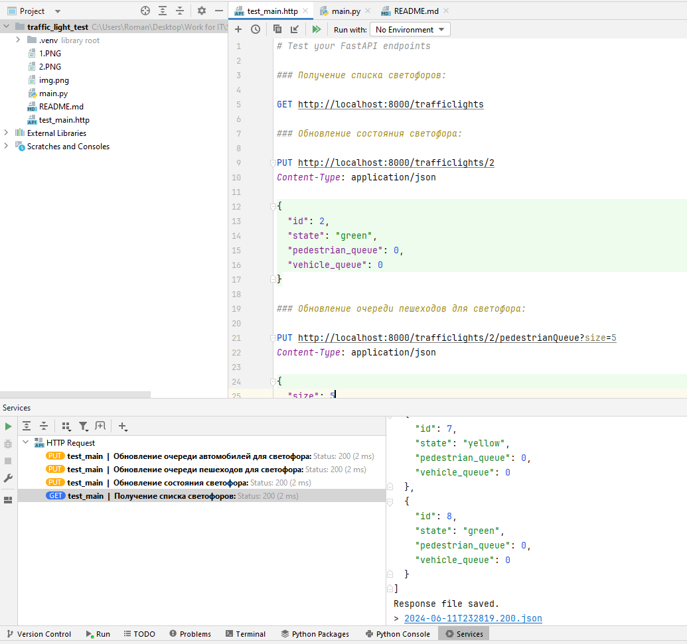

# Тестовое задание

Рассмотрим перекресток на рисунке. На нем находится несколько светофоров, регулирующих движение автомобилей (4 шт), 
и несколько - движение пешеходов по переходам (8 шт):

У пешеходных светофоров 2 состояния, у автомобильных - 3 
В каждый светофор встроена камера, которая фиксирует количество автомобилей/пешеходов в той очереди, для которых 
светофор установлен. Это очередь на противоположной стороне пешехода/перекрестка (см рисунок). Автомобили при проезде 
перекрестка едут либо прямо, либо направо. Люди и автомобили осуществляют переход или проезд перекрестка по одному,
уменьшая размер соответствующей очереди на 1

Каждый светофор имеет уникальный id. Светофоры могут общаться при помощи событий, отсылая события друг другу по id. 
Пересылаемые события - это некоторые контейнеры с данными (например, там может лежать количество людей/автомобилей 
в очереди, id отправителя, текущее состояние светофора). Светофор может взводить таймер, который через заданное 
время отсылают заданное событие на заданный id. Отправка события - это помещение контейнера в очередь событий для 
светофора, у каждого светофора очередь своя собственная. Светофоры обрабатывают события параллельно, независимо 
друг от друга. При этом каждый светофор обрабатывает свои события последовательно, в том порядке, в каком они 
помещаются в очередь. Светофор может получить информацию о текущем состоянии любого другого светофора синхронно 
(не через событие).

## Задача: 
Придумать и описать адаптивный алгоритм работы светофоров для оптимизации общей пропускной способности 
перекрестка в зависимости от ситуации на перекрестке.

## Решение:
Для реализации данной задачи на Python можно использовать фреймворк FastAPI для создания API, а также библиотеку 
asyncio для асинхронной обработки событий светофоров.

## Описание работы кода:
Этот код создает API для управления светофорами и запускает асинхронные задачи для обработки событий светофоров. 
Каждый светофор имеет свой собственный цикл обработки событий, который выполняется постоянно. 
Если состояние светофора "зеленый", то он ждет определенное время в зависимости от количества автомобилей в очереди, 
затем переходит в состояние "желтый" и ждет 5 секунд, после чего переходит в состояние "красный". 
Если состояние светофора "желтый" или "красный", то он ждет определенное время в зависимости от количества людей 
в очереди, после чего переходит в состояние "зеленый".

## Проверка:
Для проверки работоспособности приложения:
- Клонируйте проект;
- Установите зависимости:

```
pip install -r requirements.txt
```
- Запустите сервер и отправьте запросы, например:

1. Получение списка светофоров:
```
GET http://localhost:8000/trafficlights
```

2. Обновление состояния светофора:
```
PUT http://localhost:8000/trafficlights/1
Content-Type: application/json

{
  "id": 1,
  "state": "red",
  "pedestrian_queue": 0,
  "vehicle_queue": 0
}
```

3. Обновление очереди пешеходов для светофора:
```
PUT http://localhost:8000/trafficlights/2/pedestrianQueue?size=5
Content-Type: application/json

{
  "size": 5
}
```

4. Обновление очереди автомобилей для светофора:
```
PUT http://localhost:8000/trafficlights/1/vehicleQueue?size=10
Content-Type: application/json

{
  "size": 10
}
```
Вы также можете использовать другие методы HTTP такие, как DELETE и PATCH, чтобы удалить или частично обновить 
светофоры.

## Скриншоты




